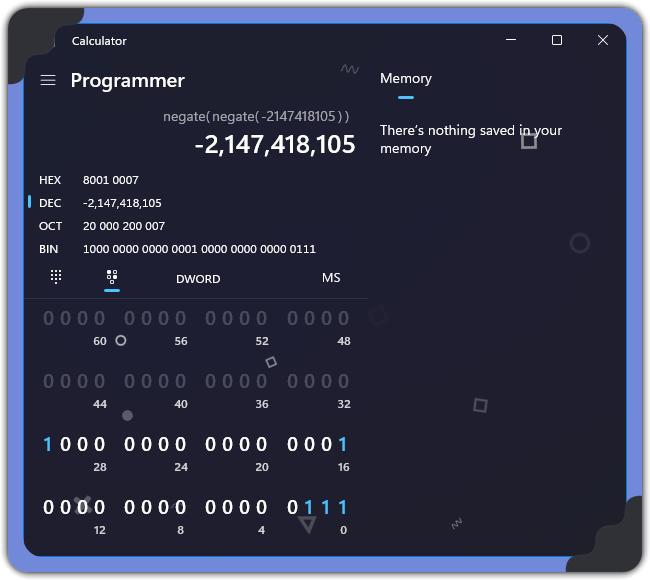

For this we want to login as `logins[7]` (admin) to get the flag, but there is a `    unsigned short idx = read_int_lower_than(NUM_USERS - 1);` statement that prevents us from accessing it directly in this way.

Let's look at this function first:
```C
int read_int_lower_than(int bound) {
    int x;
    scanf("%d", &x);
    if(x >= bound) {
        puts("Invalid input!");
        exit(1);
    }
    return x;
}
```

As hinted in the name of the challenge, we can make use of integer underflow here since this function uses *signed* integers, but the variable we're storing is an `unsigned short`. Assuming a 4-byte (32bit) integer, any larger integer that still has the 3 least significant bits on will successfully underflow to index 7 (i.e. 8th value) as desired.

For my attempt, I used windows programming calculator to draft an 8-byte negative integer meeting that requirement like so:



Negative integers following  only requires the most significant bit to be flipped. The specifics of two's or one's complement don't matter here as we're exploiting underflow behaviour here, i.e. binary truncation)

Following this we're logged in as admin and have shell access. Running `ls` shows us our flag file, and `cat`-ing the flag file gives us our flag

Flag = `DUCTF{-65529_==_7_(mod_65536)}`
